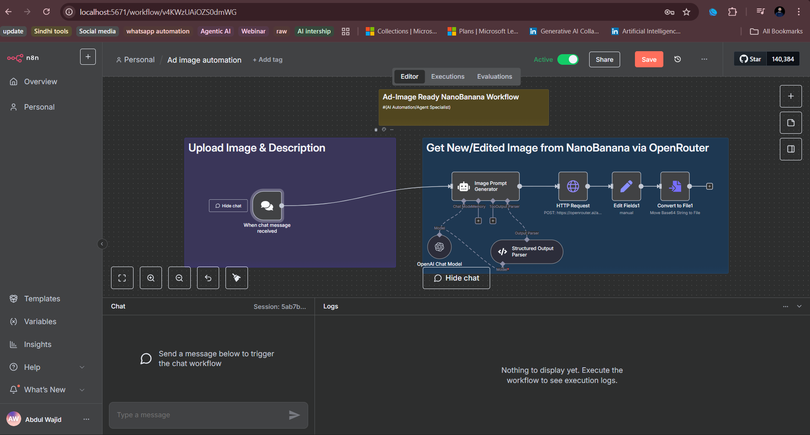

# Ad Image Automation

## Overview

The **Ad Image Automation** workflow automates the generation of ad images using AI-driven prompts. The workflow integrates with OpenAI's GPT-4 and external APIs to create image prompts and then triggers image generation tasks to deliver custom ad visuals based on provided product descriptions.

## Workflow Description

- **OpenAI Chat Model**: Utilizes OpenAI GPT-4 to generate image prompts.
- **Image Prompt Generator**: Generates a detailed prompt for an image creation AI based on the product details.
- **Structured Output Parser**: Processes the output from the image prompt generator into a structured format.
- **HTTP Request**: Sends the image prompt data to external APIs for image generation.
- **Convert to File**: Converts the generated image URL into a downloadable image file.
- **Sticky Notes**: Used to display helpful reminders and information during the workflow.
- **Webhook Integration**: Waits for chat messages to trigger the workflow and send new image requests.

## Features

- **AI-driven Image Generation**: Automatically generates ad images based on text prompts.
- **Customizable Workflow**: Easily adaptable to different types of ad creation projects.
- **Image File Conversion**: Converts image URLs into downloadable formats.
- **Real-time Notifications**: Sends updates and progress notifications throughout the process.

## Usage

1. Provide the product information or description.
2. Trigger the workflow by sending a chat message or using the webhook.
3. Review the generated image and download it for use in ads.

## Example Flow

- **Input**: Product description such as "Smartphone with a sleek design."
- **Output**: An ad image showing the product in a relatable setting, ready for use in marketing campaigns.


## Screenshots

### Placeholder Image



---


## Installation

1. Clone this repository:

   ```bash
   git clone <repository-url>
   cd <project-folder>
   ```

2. Install the required dependencies:

   ```bash
   npm install
   ```

3. Start the n8n server:

   ```bash
   n8n start
   ```

4. Trigger workflows via the n8n UI or via webhook.

---

## Contribution

Feel free to fork this project and make pull requests. Any improvements or bug fixes are welcome!
